<!------------------------------------------------------------>
<!-- Topic: xxx -->

<h2>Hour of Code 2016</h2>

<small>https://www.khanacademy.org/computer-programming/new/pjs</small> 
<small>http://emmettracicot.com</small> 
<small>https://www.khanacademy.org/computing/computer-programming/programming</small>

<!------------------------------------------------------------>
--SLIDE--
<!-- Topic: Computers -->

<h2>Computers are</h2>

<h2><b>everywhere</b></h2>

<!------------------------------------------------------------>
--SLIDE--
<!-- Topic: Languages -->

<h2><b>Language</b></h2>

<h2>is important</h2>

--SUBSLIDE--

<h2>Computers speak</h2>

<h2><b>many</b> languages</h2>

--SUBSLIDE--

<h1>... called <b>Code</b></h1>

--SUBSLIDE--

<h2>Not all <b>code</b></h2>

<h2>looks <b>scary</b></h2>

--SUBSLIDE--

<h2>Code is <b>Fun</b></h2>
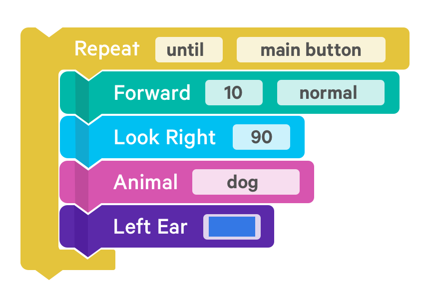

--SUBSLIDE--

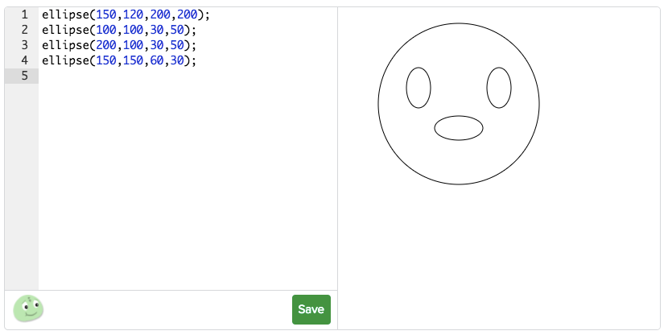

--SUBSLIDE--

<h3>Code can make things fast!</h3>

<!------------------------------------------------------------>
--SLIDE--
<!-- Topic: Code -->

<h2><b>Code</b> basics</h2>

--SUBSLIDE--

<h2>Variables</h2>

--SUBSLIDE--

<pre><code>
>>> x = 1
>>> x
1
>>> y = 2
>>> y
2
>>> x + y
3
>>> x = 10
>>> x + y
12
</code></pre>

--SUBSLIDE--

<h2><b>Input</b> and <b>Output</b></h2>

--SUBSLIDE--

--SUBSLIDE--

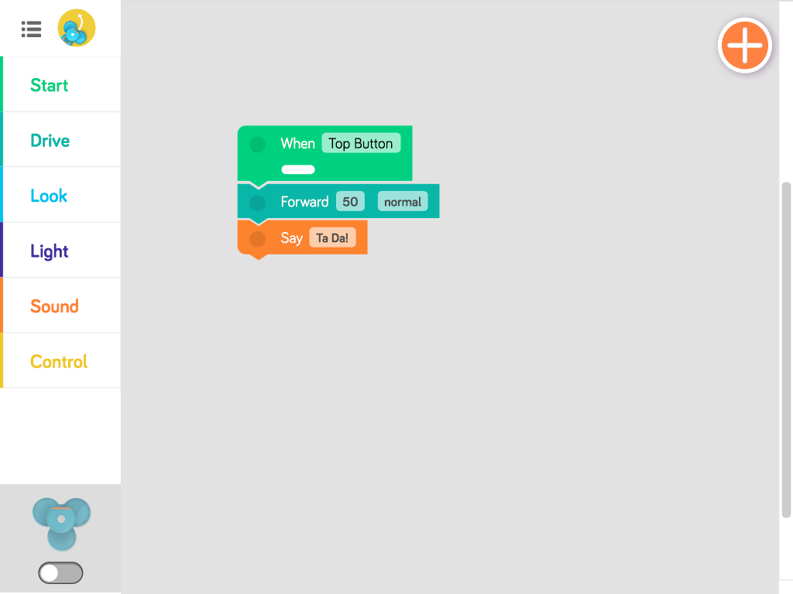

--SUBSLIDE--

<h2><b>If</b></h2>

--SUBSLIDE--

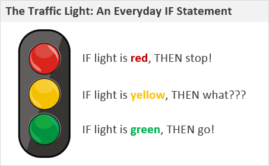

--SUBSLIDE--

<h2><b>Loops</b></h2>

--SUBSLIDE--

--SUBSLIDE--

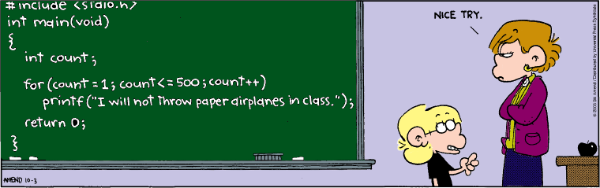

--SUBSLIDE--

<h2><b>Functions</b></h2>

<h3>Give a name to blocks of code...</h3>

--SUBSLIDE--

<h2><b>Use over and over...</b></h2>
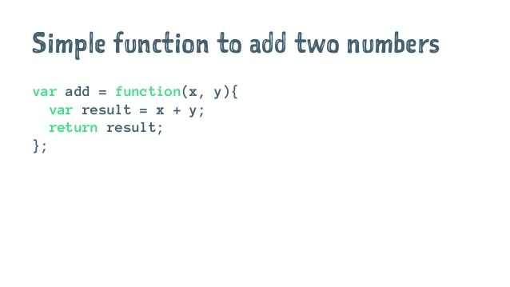

<!------------------------------------------------------------>
--SLIDE--
<!-- Topic: Logic -->

<h2><b>Critical Thinking</b></h2>

--SUBSLIDE--

<h2><b>Math</b></h2>

--SUBSLIDE--

<h2><b>Logic</b></h2>

--SUBSLIDE--

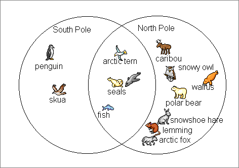

<!------------------------------------------------------------>
--SLIDE--
<!-- Topic: Example -->

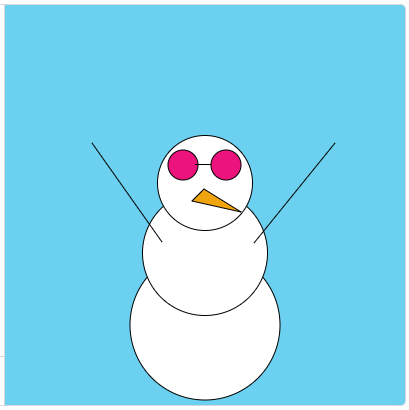

--SUBSLIDE--

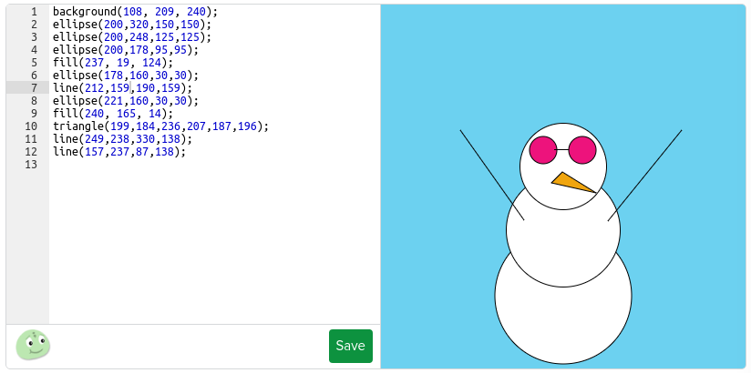

--SUBSLIDE--

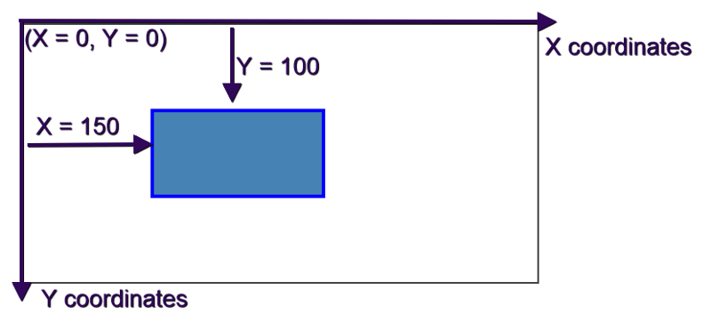

--SUBSLIDE--

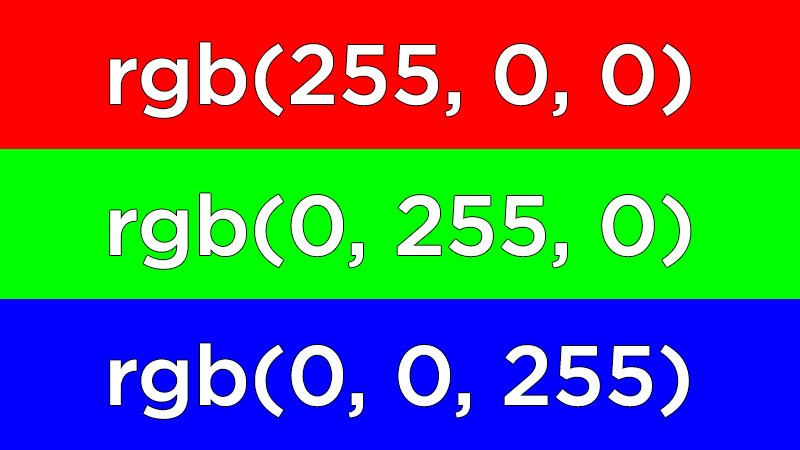

--SUBSLIDE--

<h2>We are using Javascript</h2> 
<h2><b>Syntax Matters!!!!</b></h2>

<pre><code>
ellipse(100,200,50,50);
</code></pre>

--SUBSLIDE--

<pre><code>
if (mouseIsPressed) {
    playSound(getSound("rpg/giant-no"));
}
</code></pre>

--SUBSLIDE--

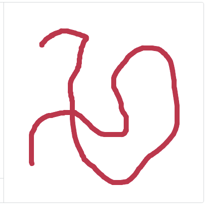

--SUBSLIDE--

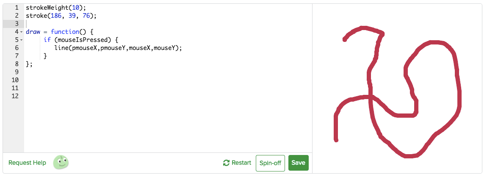

--SUBSLIDE--

<h2>Documentation</h2>
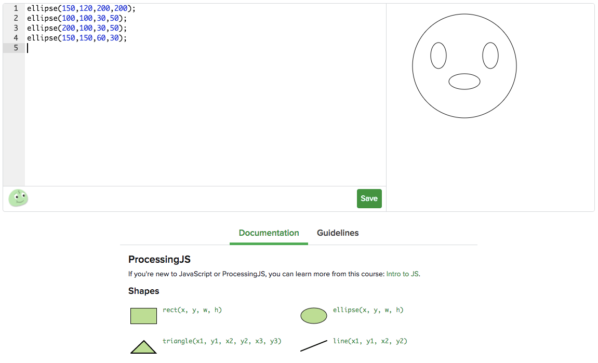

--SUBSLIDE--

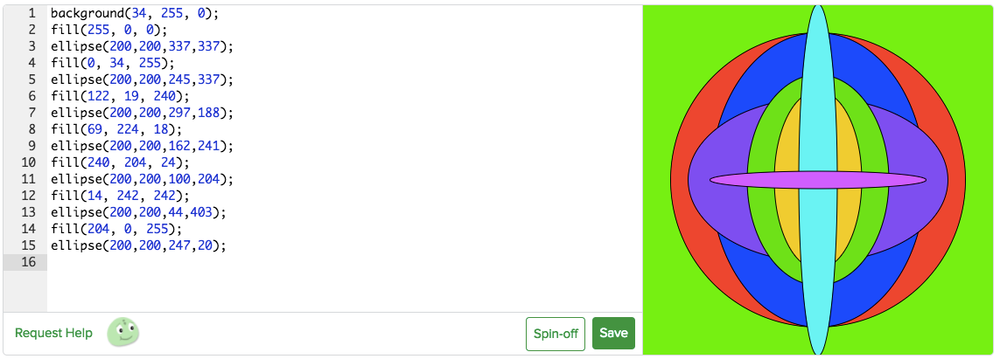

<!------------------------------------------------------------>
--SLIDE--
<!-- Topic: Example -->

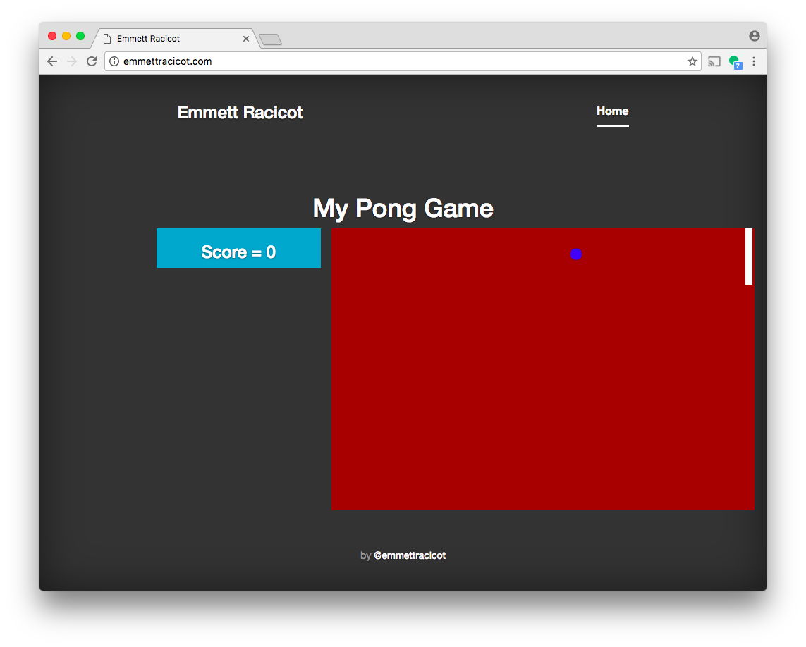

